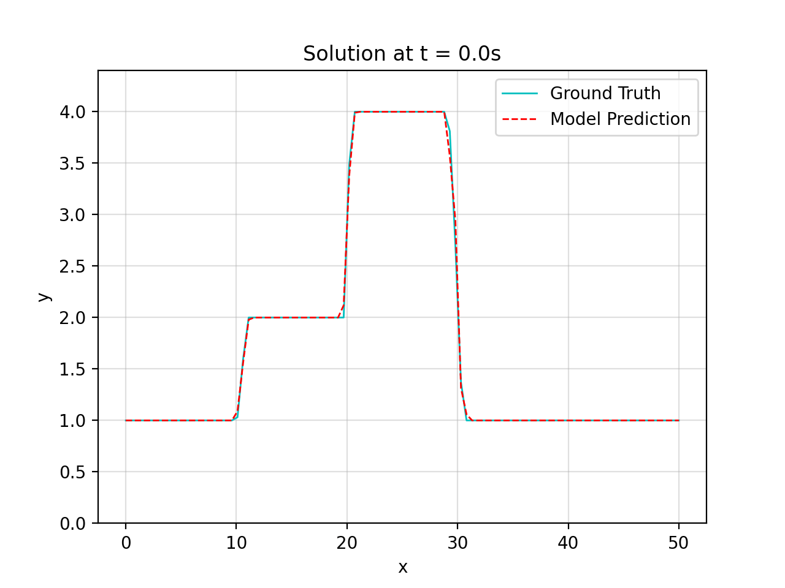
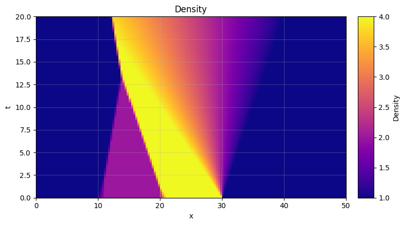
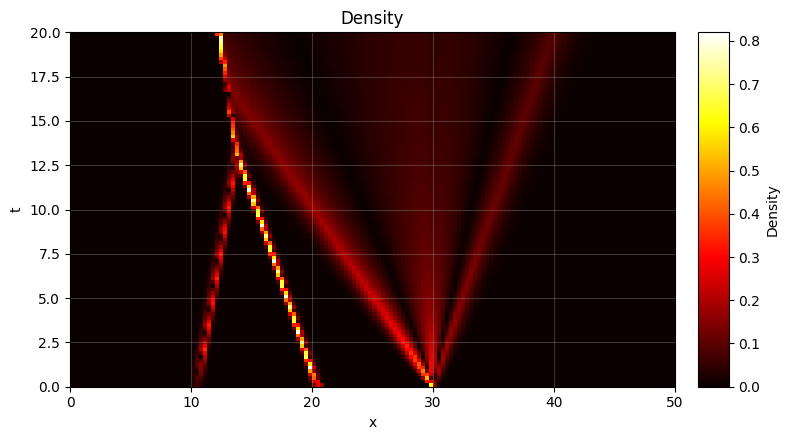
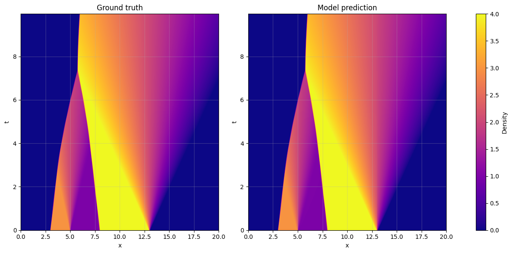

# Deep learning of first-order nonlinear hyperbolic conservation law solvers

**FVschemesOptim** is a Python package that contains the codebase for the paper *"Deep learning of first-order nonlinear hyperbolic conservation law solvers"*. The results presented in the paper can be reproduced using the scripts contained in the folder `Training Scripts`. 


- [**Abstract**](https://github.com/VictorMorand/FVschemesOptim#abstract)
- [**Installation**](https://github.com/VictorMorand/FVschemesOptim#installation)
- [**Usage Tutorial**](https://github.com/VictorMorand/FVschemesOptim#usage-tutorial)
- [**Available datasets**](https://github.com/VictorMorand/FVschemesOptim#available-datasets)
- [**Implemented models**](https://github.com/VictorMorand/FVschemesOptim#implemented-models)
  - [**1D CNN schemes**](https://github.com/VictorMorand/FVschemesOptim#our-models)
  - [**Baseline schemes**](https://github.com/VictorMorand/FVschemesOptim#baselines)


# Abstract

> In this contribution, we study the numerical approximation of scalar conservation laws by computational
optimization of the numerical flux function in a first-order finite volume method. The cell-averaging inherent
to finite volume schemes presents a challenge in the design of such numerical flux functions toward achieving
high solution accuracy. Dense neural networks, as well as (piecewise) polynomials, serve as function classes
for the numerical flux. Using a parameterization of such a function class, we optimize the numerical flux
with respect to its solution accuracy on a set of Riemann problems for which we have closed-form solutions.
By design, our resulting first-order finite volume schemes are conservative.
We show empirically that the proposed schemes can achieve higher accuracy than the Godunov and Enquist-
Osher method on a wide range of discretizations.
The proposed method can be applied to the inverse problem, i.e., the data-driven synthesis of macroscopic
physical laws for real-world flux phenomena.

We showcase here side by side animations of solutions computed by the Godunov scheme (left) and by our models (right). The discretization grid is 100x100, $\delta x = \delta t = 0.5$.

|  | SpeedModel-pred100x100.gif) |
|:--------------------------:|:--------------------------:|
|   Prediction of Godunov scheme         |   Prediction of our neural network-based scheme         |

# Installation

`FVschemesOptim` can be installed directly from source with:
```sh
pip install git+https://github.com/VictorMorand/FVschemesOptim
```

# Usage Tutorial

This package uses the general framework for first order FVM schmes available in [this repository](https://github.com/NiMlr/traffic-model-synthesis). We detail here some of the main functinnalities.  

## Data class
 
We store density data in a custom class, `Qdata` that only encapsulate `numpy.ndarray` and stores the grid parameters `dx` and `dt` along with the density array.

Usage:
```python
import numpy as np
from trafsyn.utils import Qdata

a = np.array(   [[1,2],
                 [3,4],]    )
data = Qdata(a,dx=.1,dt=.2)

print(data.shape)
>>> (2, 2)
print(2*data)
>>> [[2 4]
     [6 8]]
print(data.dx,data.dt)
>>> 0.1 0.2
```

### Available datasets

Several datasets are provided along with the package: 

| File Name    | Description                                                       | Cell dx | Cell dt | Shape      |
|--------------|-------------------------------------------------------------------|---------|---------|------------|
| 1wave.npy    | Solution of non-local model with one wave                         | 0.05    | 0.05    | (200,100)  |
| 5waves.npy   | Solution of non-local model with five wave                        | 0.05    | 0.05    | (200,100)  |
| LWRexact.npy | Discretized Exact solution of LWR model                           | 1/3     | 1/3     | (150,100)  |
| LaxHopfHD.npy  | Finely discretized solution of LWR computed with a Lax-Hopf solver | 0.02    | 0.02    | (500,250) |

One can also easily generate exact discretized solutions using the tools provided in `Baselines/LWR.py`.

### Quick visualization
We also provide some tools to load, save and visualize data arrays:

```python
from trafsyn.utils import loadData
from trafsyn.plot import PlotData

data = loadData("LWRexact.npy")
PlotData(data)
```



## Model Interface

For easier comparaison between very different implementations of our schemes, we propose a generic `Model` interface. That can be used as follows:
```python
from trafsyn.utils import Model, loadData
from trafsyn.plot import PlotData
from trafsyn.Baselines.NumSchemes import GodunovModel, f_greenshield

data = loadData("LWRexact.npy") #load example data
model = GodunovModel(f=f_greenshield,q_c=2) #example implementation of Model interface

#make 100 predictions from the initial state of data
rho_0 = data[:,0]
pred_100 = model(rho_0,100)

#example plot absolute error of model prediction w.r.t. ground truth
PlotData(np.abs(pred_100 - data[:,:100]),cmap='hot')
``` 



# Implemented models

## Our models

### 1D-CNNs models

The implementation of 1D-CNN or (a,b)-stencil models can be found in `trafsyn/torchModels.py`
We also provide in `./models/` checkpoints for our best performing models.

| File Name    | Description                                                       | Depth | Hidden dimension | Total number of parameters     |
|--------------|-------------------------------------------------------------------|---------|---------|------------|
| (0,1)cnnSPEEDmodel.pth | (0,1)-Speed model parameters, predicting the speed from density        | 6   | 15    | 1261 |
| (0,1)cnnFLOWmodel.pth | (0,1)-Flow model parameters, predicting the flow from density        | 6   | 15    | 1261 |
| (1,2)cnnSPEEDmodel.pth | (1,2)-Speed model parameters, predicting the flow from density        | 6   | 15    | 1291 |


They can be quickly tested as follows. 
```python
# Evaluate the (0,1)-Speed Model on example data
from trafsyn.torchModels import loadTorchModel 
from trafsyn.utils import evaluate, loadData

dataHD = loadData("LaxHopfHD.npy")
SpeedModel = loadTorchModel("traffic-model-synthesis/models/(0,1)cnnSPEEDmodel.pth")
evaluate(SpeedModel,dataHD,plot=True,loss="l2",animate=True)
```
```
>>>
MODEL EVALUATION...
number of parameters: 1261
Computed l2 on data: 0.30815014168045407
```


### Polynomial flux model


## Baselines

We also provide in `trafsyn/Baselines/NumSchemes.py` implementations of classical schemes used to compute approximated solutions for conservation laws.

### Godunov scheme
For 1D-scalar CLAW with a *concave* flux , The godunov scheme can be explicitly written as:
```math
\rho_i^{n+1}=\rho_i^n-\tfrac{\delta t}{\delta x}\left(\mathcal{F}_G(\rho_{i}^n,\rho_{i+1}^n)-\mathcal{F}_G(\rho_{i-1}^n,\rho_{i}^n)\right),\ n \geq 0,\ i\in\{0,\ldots,N_{x}\}
```
with the numerical flux function $`\mathcal{F}_{G}: \mathbb{R}^2 \to \mathbb{R}`$ defined as:
```math
\mathcal{F}_\text{G}: \left(\rho_1, \rho_2\right) \mapsto 
\begin{cases}
    f\left(\rho_2\right) & \text { if } \rho_{\text{c}}<\rho_2<\rho_1 \\
    f\left(\rho_{\text{c}}\right) & \text { if } \rho_2<\rho_{\text{c}}<\rho_1 \\ 
    f\left(\rho_1\right) & \text { if } \rho_2<\rho_1<\rho_{\text{c}} \\
    \min \left(f\left(\rho_1\right), f\left(\rho_2\right)\right) & \text { if } \rho_1 \leq \rho_2.
\end{cases}
```

The proposed implementation can be used as follows:
```python
from trafsyn.Baselines.NumSchemes import GodunovModel, f_greenshield

dataHD = loadData("LaxHopfHD.npy")
f = lambda X: f_greenshield(X,v=1,qmax=4)
Gmodel = GodunovModel(f=f,q_c=2)
evaluate(Gmodel,dataHD,loss="l2",animate=True)

>>> MODEL EVALUATION...
number of parameters: 2
Computed l2 on data: 0.5169970010752484
```




### Engquist-Osher scheme

For 1D-scalar CLAW with a *strictly concave* flux , The Engquist-Osher scheme can be explicitly written as:
```math
\rho_i^{n+1}=\rho_i^n-\frac{\delta t}{\delta x}\left(\mathcal{F}_{\text{EO}}(\rho_{i}^n,\rho_{i+1}^n)-\mathcal{F}_{\text{EO}}(\rho_{i-1}^n,\rho_{i}^n)\right), \ \  n \geq 0,\ i\in\{0,\ldots,N_{x}\}
```

with the numerical flux function $\mathcal{F}_{\text{EO}}: \mathbb{R}^2 \to \mathbb{R}$ defined as:
```math
\mathcal{F}_{\text{EO}}: \left(\rho_1, \rho_2\right) \mapsto 
\begin{cases}
    f\left(\rho_1\right) & \text { if } \rho_2,\rho_1 \leq \rho_{\text{c}} \\
    f\left(\rho_2\right) & \text { if } \rho_2,\rho_1 > \rho_{\text{c}} \\
    f\left(\rho_{\text{c}}\right) & \text { if } \rho_2 \leq \rho_{\text{c}} <\rho_1 \\
    f(\rho_1)+f(\rho_2) - f(\rho_{\text{c}}) & \text { if } \rho_1 \leq \rho_{\text{c}} <\rho_2 .
\end{cases}
```

The proposed implementation can be used as follows:

```python
from trafsyn.Baselines.NumSchemes import EngquistOsherModel, f_greenshield
from trafsyn.utils import evaluate, loadData

dataHD = loadData("LaxHopfHD.npy")
f = lambda X: f_greenshield(X,v=1,qmax=4)
EOmodel = EngquistOsherModel(f=f,q_c=2)
print(f"l2 error of Engquist Osher on data : {evaluate(EOmodel,dataHD,loss='l2',plot=False,verbose=False)}")

>>> l2 error of Engquist Osher on data : 0.5179692156307062
```

### Lax-Friedrichs scheme

For 1D-scalar CLAW with any flux, The Lax-Friedrichs scheme can be explicitly written as:

```math
\rho_i^{n+1}= \frac{1}{2}(\rho_{i-1}^n + \rho_{i+1}^n)-\frac{\delta t}{2 \delta x}\left(f(\rho_{i+1}^n) - f(\rho_{i-1}^n)\right), \ \  n \geq 0,\ i\in\{0,\ldots,N_{x}\}
``` 

The proposed implementation can be used as follows:

```python
from trafsyn.Baselines.NumSchemes import LaxFriedrichs, f_greenshield
from trafsyn.utils import evaluate, loadData

dataHD = loadData("LaxHopfHD.npy")
f = lambda X: f_greenshield(X,v=1,qmax=4)
LxFmodel = LaxFriedrichs(f=f)
print(f"l2 error of LaxFriedrichs on data : {evaluate(LxFmodel,dataHD,loss='l2',plot=False,verbose=False)}")

>>> l2 error of LaxFriedrichs on data : 1.4117571542273117
```
